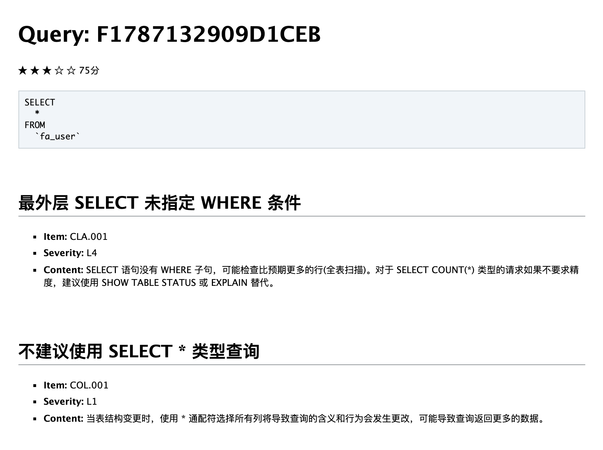
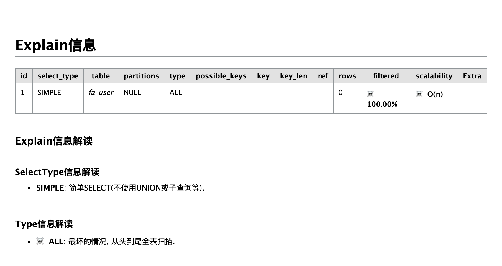

<h1 align="center">think-soar</h1>

<p align="center">SQL 语句优化器和重写器</p>

> 适用于 thinkphp5 SQL 语句优化器扩展包，基于 **[guanguans/soar-php](https://github.com/guanguans/soar-php)**

[](https://travis-ci.org/guanguans/think-soar)
[](https://scrutinizer-ci.com/g/guanguans/think-soar/build-status/master)
[](https://scrutinizer-ci.com/g/guanguans/think-soar/?branch=master)
[](https://github.styleci.io/repos/195521139)
[](https://packagist.org/packages/guanguans/think-soar)
[](https://packagist.org/packages/guanguans/think-soar)
[](https://packagist.org/packages/guanguans/think-soar)

## 环境要求

* [topthink/framework 5](https://github.com/top-think/framework)

## 安装

``` shell
$ composer require guanguans/think-soar --dev
```

## 使用

### 下载 [XiaoMi](https://github.com/XiaoMi/) 开源的 SQL 优化器 [soar](https://github.com/XiaoMi/soar/releases)，更多详细安装请参考 [soar install](https://github.com/XiaoMi/soar/blob/master/doc/install.md)

``` bash
# macOS
$ wget https://github.com/XiaoMi/soar/releases/download/0.11.0/soar.darwin-amd64
# linux
$ wget https://github.com/XiaoMi/soar/releases/download/0.11.0/soar.linux-amd64
# windows
$ wget https://github.com/XiaoMi/soar/releases/download/0.11.0/soar.windows-amd64
# 用其他命令或下载器下载均可以
```

### 配置，更多详细配置请参考 [soar config](https://github.com/XiaoMi/soar/blob/master/doc/config.md)

拷贝 `config\soar.php` 到 `thinkphp` 配置目录下，修改对应的配置即可。

### SQL 评分

**方法调用示例：**

``` php
<?php
namespace app\index\controller;

use think\Db;

class Index
{
    public function tests()
    {
        $user = Db::table('fa_user')->where('id', 1)->select();
        $sql = Db::table('fa_user')->fetchSql()->select();
        // 最后一条sql语句评分
        echo soar_score();
        // 指定sql语句评分
        echo soar_score($sql);
        echo soar()->score($sql);
    }
}
```

**输出结果：**



### explain 信息解读

**方法调用示例：**

``` php
<?php
namespace app\index\controller;

use think\Db;

class Index
{
    public function tests()
    {
        $user = Db::table('fa_user')->where('id', 1)->select();
        $sql = Db::table('fa_user')->fetchSql()->select();
        // 最后一条sql语句explain信息解读
        echo soar_html_explain();
        echo soar_md_explain();
        // 指定sql语句评分explain信息解读
        echo soar_html_explain($sql);
        echo soar_md_explain($sql);
        echo soar()->htmlExplain($sql);
        echo soar()->mdExplain($sql);
    }
}
```

**输出结果：**



### 语法检查

**方法调用示例：**

``` php
$sql = 'selec * from fa_user';
echo soar_syntax_check();
echo soar_syntax_check($sql);
echo soar()->syntaxCheck($sql);
```

**输出结果：**

``` sql
At SQL 1 : line 1 column 5 near "selec * from fa_user" (total length 20)
```

### SQL 指纹

**方法调用示例：**

``` php
$sql = 'select * from fa_user where id=1';
echo soar_finger_print();
echo soar_finger_print($sql);
echo soar()->fingerPrint($sql);
```

**输出结果：**

``` sql
select * from fa_user where id = ?
```

### SQL 美化

**方法调用示例：**

``` php
$sql = 'select * from fa_user where id=1';
var_dump(soar_pretty());
var_dump(soar_pretty($sql));
var_dump(soar()->pretty($sql));
```

**输出结果：**

``` sql
SELECT  
  * 
FROM  
  fa_user  
WHERE  
  id  = 1;
```

### markdown 转化为 html

**方法调用示例：**

``` php
echo soar_md2html("## 这是一个测试");
echo soar()->md2html("## 这是一个测试");
```

**输出结果：**

``` html
...
<h2>这是一个测试</h2>
...
```

### soar 帮助

**方法调用示例：**

``` php
var_dump(soar_help());
var_dump(soar()->help());
```

**输出结果：**

``` yaml
···
'Usage of /Users/yaozm/Documents/wwwroot/soar-php/soar:
  -allow-charsets string
    	AllowCharsets (default "utf8,utf8mb4")
  -allow-collates string
    	AllowCollates
  -allow-drop-index
    	AllowDropIndex, 允许输出删除重复索引的建议
  -allow-engines string
    	AllowEngines (default "innodb")
  -allow-online-as-test
    	AllowOnlineAsTest, 允许线上环境也可以当作测试环境
  -blacklist string
    	指定 blacklist 配置文件的位置，文件中的 SQL 不会被评审。
···    
```

### 执行任意 soar 命令

**方法调用示例：**

``` php
$command = "echo '## 这是另一个测试' | /Users/yaozm/Documents/wwwroot/soar-php/soar.darwin-amd64 -report-type md2html";
echo soar_exec($command);
echo soar()->exec($command);
```

**输出结果：**

``` html
...
<h2>这是另一个测试</h2>
...
```

## License

[MIT](LICENSE)